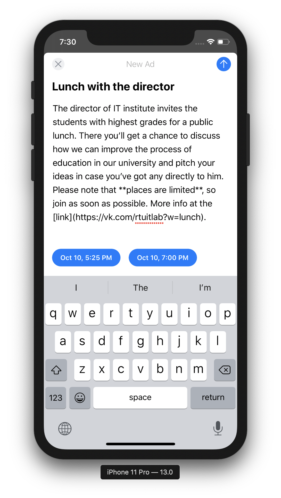
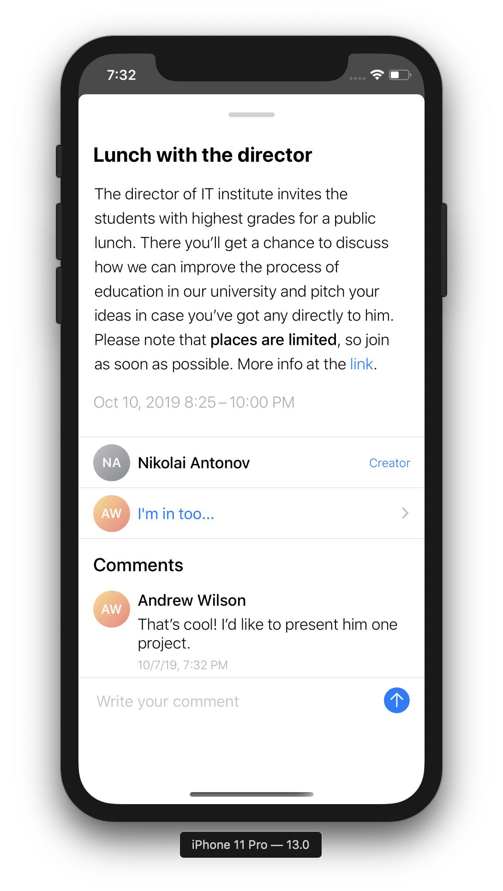

## StuDo

###### Students do it

The service help manage events and advertise them among fellow students.

#### Demo

Create ad for event           |  Find the events for you
:-------------------------:|:-------------------------:
  |  

#### Libraries Used

- [MarkdownKit](https://github.com/bmoliveira/MarkdownKit) by Bruno Oliveira [@bmoliveira](https://github.com/bmoliveira)
